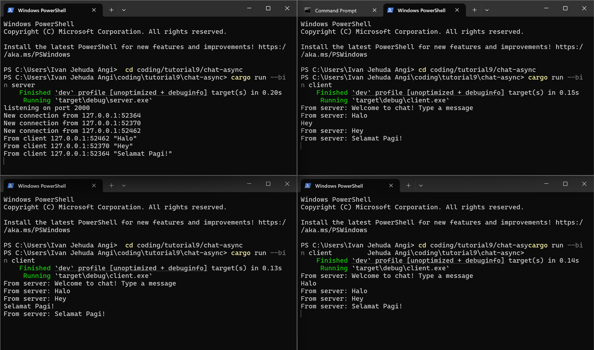
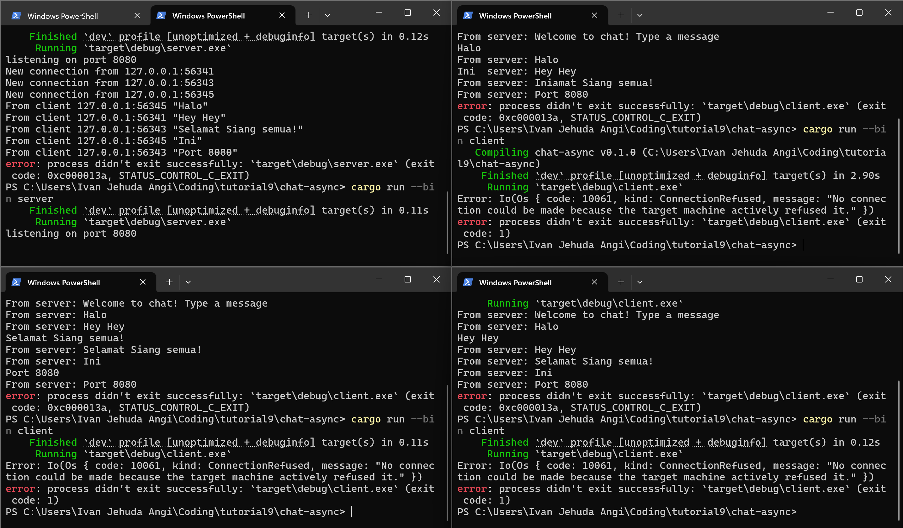
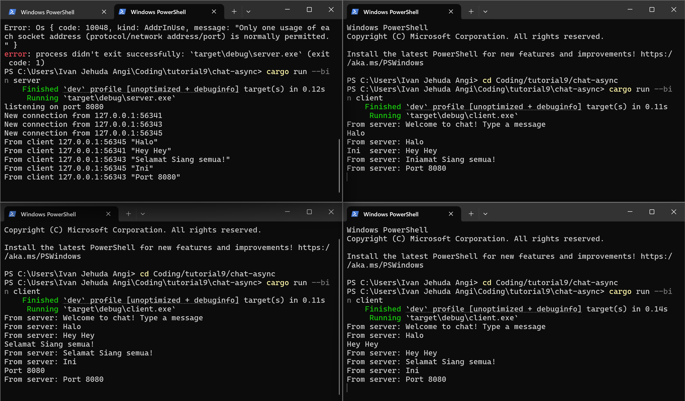
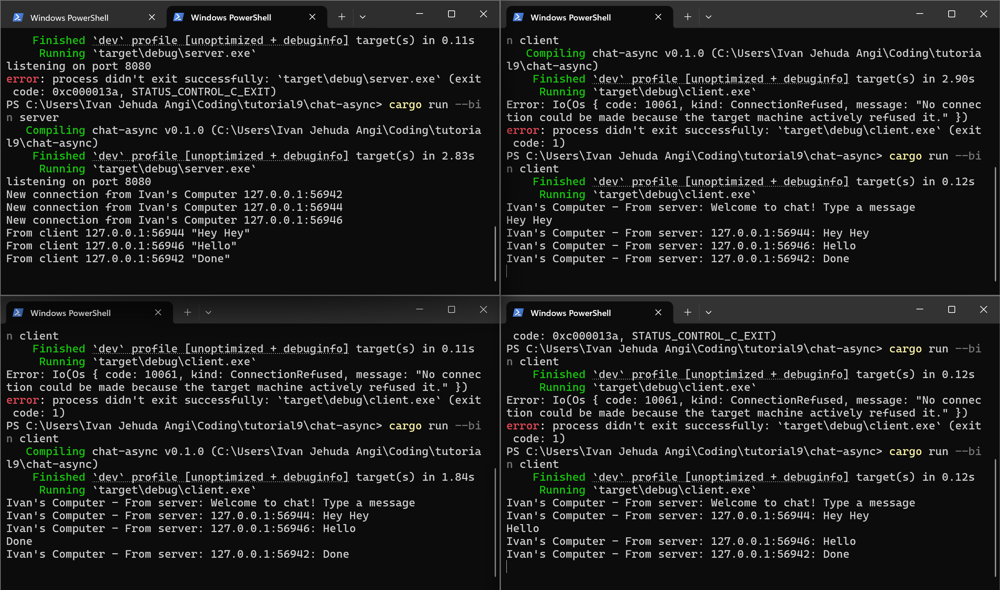

#  Module 10 Reflection
Ivan Jehuda Angi - 2306152222 - Advance Programming A

## 2.1 Original Code of Broadcast Chat

In my setup, the server runs in the top left terminal, while the clients are displayed in the top right and bottom terminals. To start either the server or a client, I use the command `cargo run --bin (server/client)`. Specifically, I launched the server using `cargo run --bin server` in the right terminal, and started the clients using `cargo run --bin client` in the left and middle terminals. When a client connects, the server logs the new connection and is aware of all active clients. If I type a message in one client, it is sent to the server, which then broadcasts it to every connected client. As a result, all clients receive the message, even though it was entered on just one of them.

---
## 2.2 Modifying Port
### Server use port 808 while  Client se Port 2000

### Server and Client Use Port 8080

In the initial case, the server was set to listen on port 2000, whereas the client attempted to connect through port 8080. This mismatch caused the connection to fail, since successful communication requires both the server and client to operate on the same port. In the second case, once both were aligned to port 8080, the WebSocket connection established without issues.

Resolving the problem required synchronizing the port number in both the server’s code (where it binds to a port) and the client’s script (where it initiates the WebSocket connection). This highlights the application's reliance on the WebSocket protocol and emphasizes the importance of matching configurations on both sides for a reliable connection.

---
## 2.3 Small changes, add IP and Port

On the server side, I began by customizing the "New connection from..." message to include my name, since that part of the code is responsible for displaying the connection log. I then updated the `handle_connection` function, specifically the section where messages are sent using `bcast_tx`, by formatting the message to also include the sender’s IP address. This change ensures that clients now see the sender’s address in the received messages. On the client side, I made a minor tweak by modifying the "From server: ..." output to also display my name.
